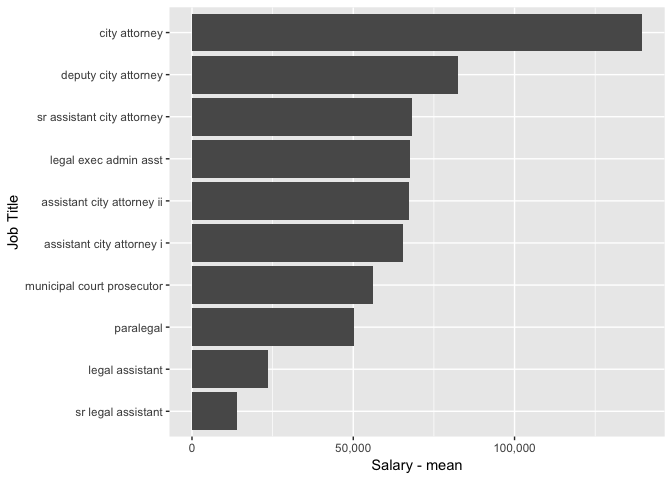

city attorney
================

Salary Data
-----------

The Fort Collins city attorney reports 24 employees on staff in 2015. Of those employees the highest paid position is the city attorney with an annual salary of $139572.62.

