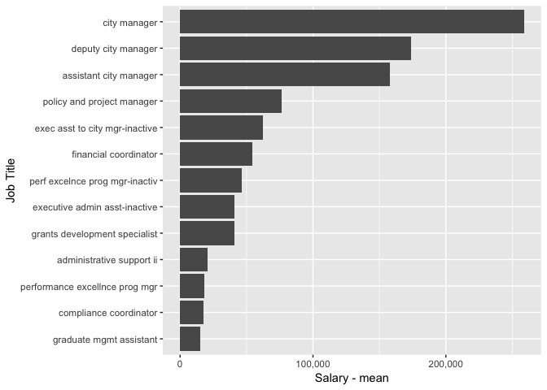

City Manager
================

Salary Data
-----------

The Fort Collins city manager reports 20 employees on staff in 2015. Of those employees the highest paid position is the city manager with an annual salary of $258704.94.

