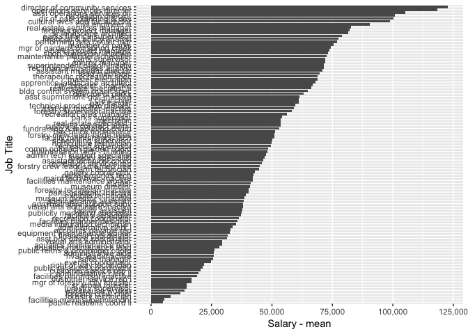

community and operation services
================

Salary Data
-----------

The Fort Collins community and operation services reports 255 employees on staff in 2015. Of those employees the highest paid position is the director of community services with an annual salary of $122836.56.

