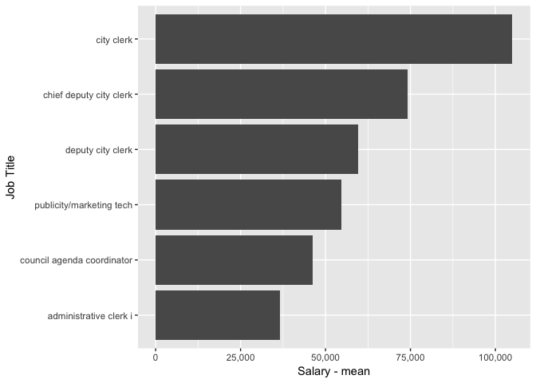

deputy city manager
================

Salary Data
-----------

The Fort Collins deputy city manager reports 6 employees on staff in 2015. Of those employees the highest paid position is the city clerk with an annual salary of $104988.29.

