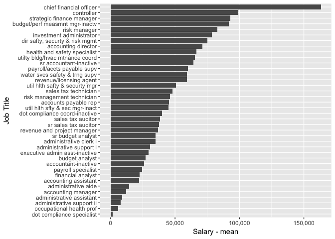

Financial Services
================

Salary Data
-----------

The Fort Collins financial services reports 55 employees on staff in 2015. Of those employees the highest paid position is the chief financial officer with an annual salary of $163179.19.

