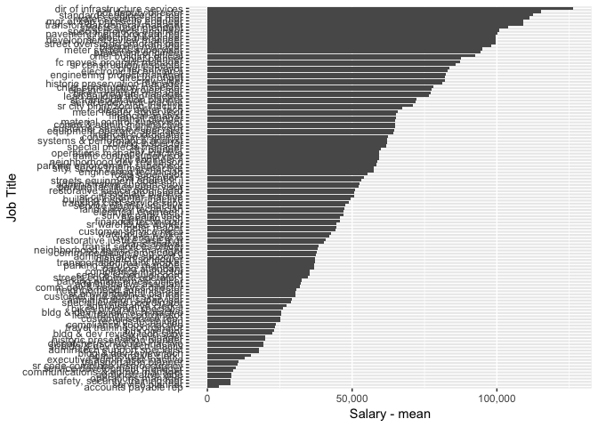

planning development & transportation
================

Salary Data
-----------

The Fort Collins planning development & transportation reports 391 employees on staff in 2015. Of those employees the highest paid position is the dir of infrastructure services with an annual salary of $126367.77.

