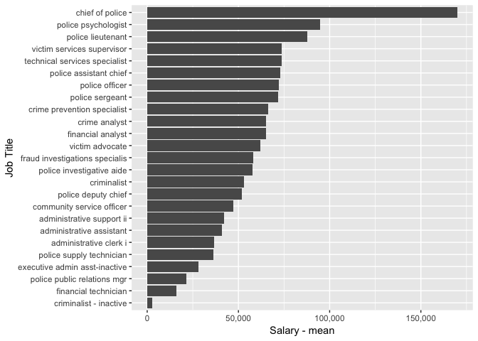

Police Services
================

Salary Data
-----------

The Fort Collins police services reports 286 employees on staff in 2015. Of those employees the highest paid position is the chief of police with an annual salary of $169963.75.

