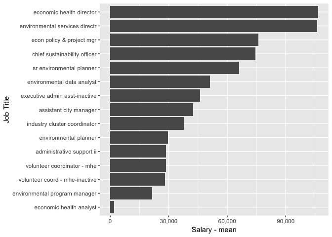

sustainability services
================

Salary Data
-----------

The Fort Collins sustainability services reports 23 employees on staff in 2015. Of those employees the highest paid position is the economic health director with an annual salary of $106553.44.

