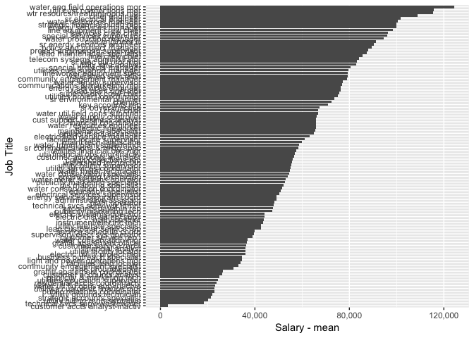

utility services
================

Salary Data
-----------

The Fort Collins utility services reports 244 employees on staff in 2015. Of those employees the highest paid position is the water eng field operations mgr with an annual salary of $124380.92.

